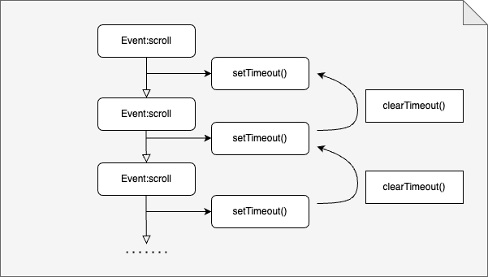
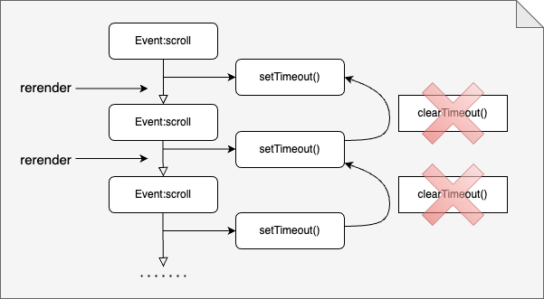
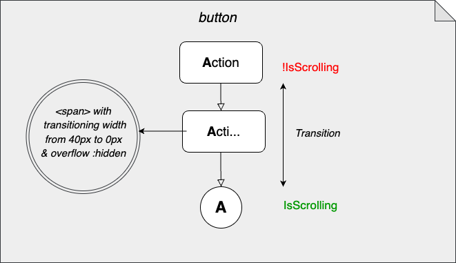

## What is a Floating Action Button 

  "A [floating action button (FAB) ](https://material.io/components/buttons-floating-action-button)represents the primary action(s) of a screen."
  
It usually has a fixed position on the screen, no matter how much the scrolling; this makes it easier for the user to access and use it. These kind of buttons are intended for very frequent or relevant actions within an app.

A collapsible action button as the name suggests shrinks to a minimal size while the user is scrolling the page. Pictures speak a thousand words so here is a gif:


## 1. Create a scrollable container

First of all, we need to create a scrollable page with some placeholder content.

``` tsx
const placeholders = new Array(99).fill(0).map((_, i) =>
  <p key={i} style={{ width: `${Math.random() * 75}%` }} />
);

function App() {
  return (
    <div>
      <h1>Collapsible Floating Action Button</h1>
      {placeholders}
      <button>Action</button>
      <b>
    </div>
  );
}
```

For this we render an array of 99 empty paragraphs with a constant height and assign a random width to each paragraph:

``` css
p {
    height: 30px;
    background-color: silver;
}
```

In a real project we would utilize a specific class name (e.g. `.placeholder`) rather than selecting a paragraph by the corresponding tag name `p` but for this tutorial we just do it the lazy way and avoid any additional attributes in our jsx code.

``` css
div {
    height: 100vh;
    overflow: scroll;
}
```

The `div` element we created in our `App` component serves as the container for the scrollable content. We want to make sure that only the content is scrollable and not the container itself. This is done by setting the `height` attribute to the height of the viewport and the `overflow` attribute to `scroll`. You will see later, that this is crucial for intercepting scroll events effectively.

## 2.  Create the floating action button

The key to this floating button, that is always in the same position at the page, is to make its position fixed `positionL: fixed;` Then, it only remains to decide where in your application it is going to be positioned (in our case at the bottom right).

``` css
button {
  position: fixed;
  bottom: 20px;
  right: 20px;
}
```

## 3.  How to collapse the button on scroll

Onscroll is an mouse event that happens every time the page is scrolled.
To handle that event, we have to write a function that sets the state we wish for, in this specific case is collapsing the floating button while scrolling is happening, and returning to its original shape when the event stops.

It is important to identify in which component is the event happening. In this case, the scrolling happens in the `div` container (remember how we limit the `height` property and set `overflow: scroll` to make it scrollable?).

In my event handler we want to be able to identify and catch both the **scrolling** and the **lack of scrolling** and set our state accordingly.
This way, while the event is taking place, we set `isScrolling` to `true`.

```ts
function App() {
  const [isScrolling, setIsScrolling] = useState<boolean>(false);

  const handleScroll: React.UIEventHandler<HTMLDivElement> = (_) => {
    setIsScrolling(true);
  };

  return (
    <div onScroll={handleScroll}>
      <h1>Collapsible Floating Action Button</h1>
      ...
    </div>
  );
}
```

Now we also need to set the state to `false` once the event is no longer happening. Unfortunately, there is no event that notifies about the completion of a scrolling event. But there is a juicy workaround that is based on setting a timeout with `setTimeout()`:

``` ts
const handleScroll: React.UIEventHandler<HTMLDivElement> = (_) => {
  setIsScrolling(true);
  setTimeout(() => setIsScrolling(false), 500);
};
```

But the tricky part comes here. For every time we scroll, there is a new scroll event firing (and there will be a lot of these). That means that we would be setting multiple timeouts every time we scroll.

Therefore, we need to use `clearTimeout()` to reset the previous timeout if a new `scroll` event is fired in under our specific time (`500 ms`). This way we make sure we clear the previous timeout and a new one is starting on very scroll.

Another thing to take into account is that `setTimeout()` returns a `timeoutId`. Thats what we are going to take as a reference when calling `clearTimeout()`.

```ts
let timeoutId;
const handleScroll = (e: any) => {
  setIsScrolling(true);
  clearTimeout(timeoutId);
  timeoutId = setTimeout(() => setIsScrolling(false), 500);
};
```




Experienced react developers probably notice the error in the previous code fragment. The problem with saving the `timeoutId` in a variable arises in situations such as actions that trigger **rerenders**.

If this were the case, this would mean that the timeout would not be cleared because its reference would have been lost (since the variable `timeoutId` is redeclared on each rerender)




The solution to that is to use the hook **useRef()** that "allows you to persist values between renders", "and it can be used to store a mutable value that does not cause a re-render when updated". _source: [w3schools](https://www.w3schools.com/react/react_useref.asp)_ 

```ts
const timeoutId = useRef<NodeJS.Timeout>();

const handleScroll = (e: any) => {
  setIsScrolling(true);
  clearTimeout(timeoutId.current);
  timeoutId.current = setTimeout(() => setIsScrolling(false), 500);
};
```

## 4. Adding a style transition to the floating button

Now, for a nice and smooth visual experience, we added a subtle transition to the button so that it changes depending on the scrolling state

```tsx
function App() {
  ...
  return (
    <div onScroll={handleScroll}>
      ...
      <button className={isScrolling ? "isScrolling" : ""}>
        <strong>A</strong><span>ction</span>
      </button>
    </div>
  );
}
```

``` css
button {
  position: fixed;
  bottom: 20px;
  right: 20px;
  transition: border-radius 0.2s ease-in;
  border-radius: 10px;
  display: flex;
  align-items: center;
  justify-content: space-around;
  min-width: 30px;
  height: 30px;
  text-align: left;
}

button.isScrolling {
  border-radius: 50%;
}

button span {
  width: 40px;
  transition: width 0.2s ease-in;
  overflow: hidden;
}

button.isScrolling span {
  width: 0px;
}
```




**Additional note:** _This article was co-authored by Denis Kruschinski_


