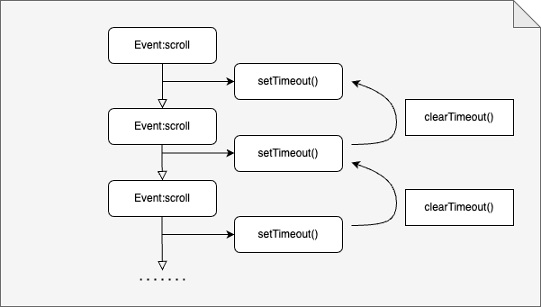
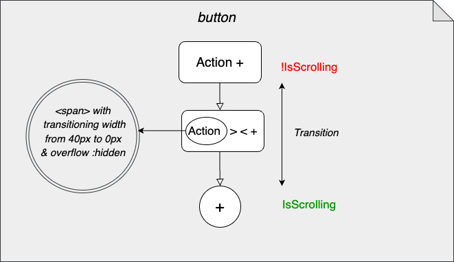

1.  How to build a scrollable page

A floating button is a button that has a fixed position on the screen, no matter how much the scrolling.
This makes it easier for the user to access and use it. These kind of buttons are intended for very frequent or relevant actions within an app.

For that implementation I used React/Typescript, and for styling I used bootstrap 5.

First of all, we need to create our empty scrollable page. The parent component gets a smaller height than the child component so that it overflows.

For example, we set **App** (parent) with a `style={{ height: "100vh" }}`and **FloatingButtons** (child) gets a bigger height `style={{ height: 5000 }}`. In order to achieve the scrolling functionality we still need to add to **App** the class `overflow-auto`:

2.  Create the floating button

The key to a floting button, that is always in the same position at the page, is to make its position fixed `position-fixed`
Then, it only rmeinas to decide where in your application it is going to be positioned.

3.  How to collapse button on scroll

Onscroll is an mouse event that happens everytime the page is scrolled.
To handle that event, we have to write a function that creates the results we wish for, in this specific case is collapsing the floating button while the event is happening, and returning to its originall shape when the event stops.

It is important to identify in which component is the event happening. In this case, the scrolling happens in the container of our parent component (it creates the scrollable page on overflow).

In my event handler I want to be able to identify and catch both the **scrolling** and the **lack of scrolling** and set my state accordingly.
This way, while the event is taking place, I set my state to _true_.

```ts
const [isScrolling, setIsScrolling] = useState<boolean>(false);

const handleScroll = (e: any) => {
  setIsScrolling(true);
};
```

Now we also need to set the state to _false_ once the event is no longer happening. For this we need to set a timeout `setTimeout()` that will set our state back to _false_ after a time.

`setTimeout(() => setIsScrolling(false), 500)`

But the tricky part comes here. For every time we scroll, there is a new scroll event firing. That means that we would be setting a timeout every time we scroll.

Therefore, we need to use `clearTimeout()` to clear the timeout if a new 'scroll' event is fired in under our specific time (_500 ms_). This way we make sure we clear the previous timeout and a new one is starting on very scroll.

Another think to take into account is that `setTimeout()` returns an timeoutId. Thats what we are going to take as areference when calling `clearTimeout()`

```ts
const [isScrolling, setIsScrolling] = useState<boolean>(false);

let timeoutId;
const handleScroll = (e: any) => {
  setIsScrolling(true);
  clearTimeout(timeoutId);
  timeoutId = setTimeout(() => setIsScrolling(false), 500);
};
```



The problem with saving the id in a let variable, though, arises in situations such as actions that trigger **rerenders**
If this were the case, this would mean that the timeout would not be cleared because its reference would have been lost(since the variable _timeoutId_ is redeclared)


The solution to that is to use the hook useRef() that "allows you to persist values between renders", "and it can be used to store a mutable value that does not cause a re-render when updated" (source: w3schools)

```ts
const timeoutId = useRef<NodeJS.Timeout>();

const handleScroll = (e: any) => {
  setIsScrolling(true);
  clearTimeout(timeoutId.current);
  timeoutId.current = setTimeout(() => setIsScrolling(false), 500);
};
```

Now we can pass with props the current state of the scroll event to our child component and style them.

```ts
<Button
    className={`d-flex position-fixed bottom-0 start-50 translate-middle mb-4 shadow ${
        p.isScrolling ? "rounded-circle" : ""
    } `}
>
```

4. Adding a style transition to the floating button

Additionally, for a nicer and smoother visual experience, you can add a subtle transition to the button so that it changes depending on the scrolling state


